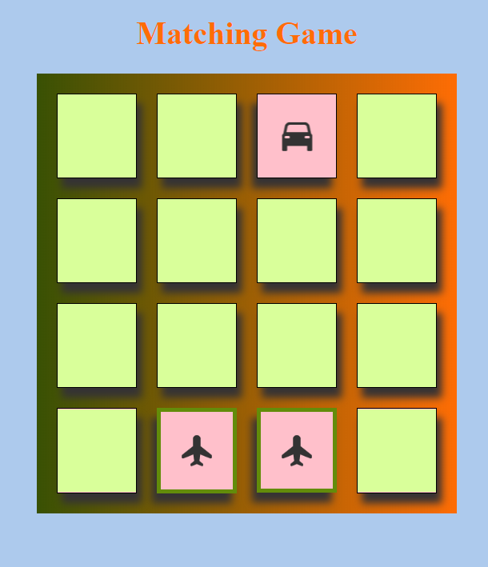

# MATCHING-GAME

;

## **Overview**
This app was created for the Chingu Voyage 21 pre-work. 
**LIVE LINK**: [here](https://matching-game-angular.herokuapp.com/)

## **Features**
* This is a simple game built by Angular framework to test a user's memory by flipping 8 pairs of matched cards.

* Creates a deck of cards randomly shuffled whenever the new game is played.

* Creates wining game rule that when all matches are found, the user wins the game.

* Creates rules of playing game including picking only 2 cards per turn, disabling the same card to be clicked twice, adding effects to the matched cards and displaying a message saying "you won!" and a buttton "New Game" to start a new game when user wins the game! 

* Has animations for flipped cards and makes the app responsive across multiple devices. 

### **Running The Project**

#### Installing the code
1. Ensure you have node version 10.16.0 or higher before proceeding.
2. Download or clone the code from this repository
3. Change to the root directory and run the script `npm install` to install the depedencies.
4. Run `ng serve --open` and navigate to http://localhost:4200 in the browser.
